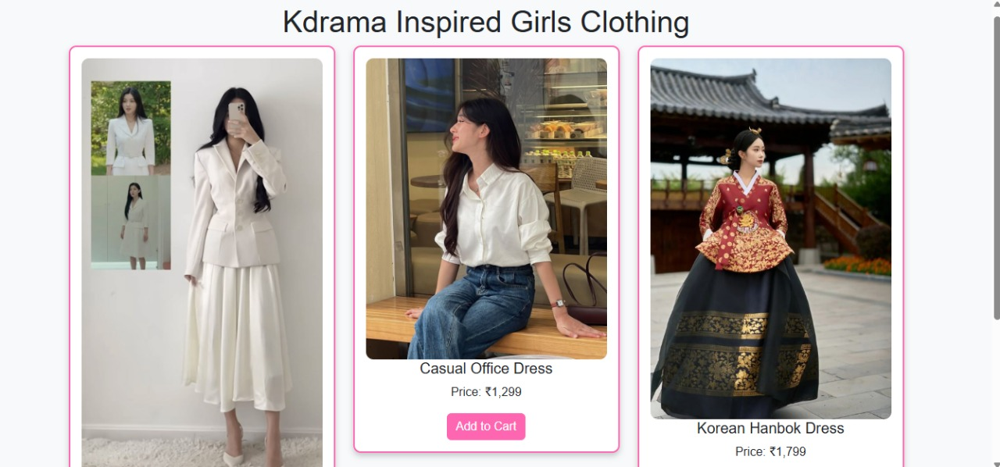

## Kdrama Inspired Girls Clothing - E-commerce Product Page

## Description
This project is an e-commerce product page showcasing Kdrama Inspired Girls Clothing. Users can browse stylish dresses, add them to their cart, and view the total cost of their selections.

## Tech Used
1) HTML for structure
2) CSS for styling
3) Bootstrap for responsive layout and UI components
4) jQuery for dynamic cart updates and interactivity
5) JavaScript for handling cart functionality

## Features

✅ Stylish Kdrama-inspired dress collection
✅ Thumbnail grid layout for product display
✅ Add-to-cart functionality with price updates
✅ Shopping cart section to list selected items
✅ Dynamic price calculation for total cart value
✅ Bootstrap responsive design for a seamless user experience

## Installation & Usage

Clone or download the repository.
Ensure that all dress images (dress1.jpg to dress5.jpg) are in the same directory as the HTML file.
Run the index.html file in a web browser.

## Preview
This e-commerce page features a modern, clean UI with an interactive shopping experience, making it easy for users to browse and purchase trendy Kdrama outfits.

## 📸 Screenshot of the project
(screenshot6.jpg)

## 📩 Contact
reach out to me at [vidhi.23bce11014@vitbhopal.ac.in].

Happy Shopping! 🛍️✨